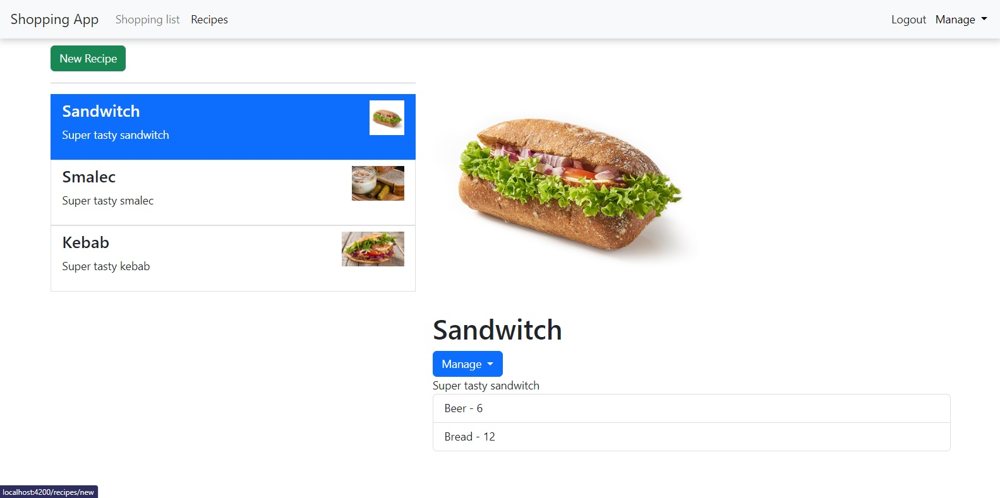

# RecipesApp
Manage your recipes and shopping lists in one place - Angular / Spring project.

Angular project is part of Udemy course made by Maximilian Schwarzmüller.
Spring project was made entirely by me.

## Tech stack
 - Angular, Typescript, Bootstrap
 - Spring boot 3, Java 17

## Installation

For backend: build project via gradle and then run `main` method in `RecipesApplication.java`. Web server will be hosted at address `http://localhost:8080`

For frontend: install all dependencies via `npm i` and then use `ng serve`. Application will be ready to view at address `http://localhost:4200`
